# Planer brand catalog

The vocabulary for asking for pieces: *"usá PostCard en un IgPost"*, *"un EmailBanner con BigStat y CouponTicket"*.
Every name below is exact: it is the `use` of a layer in content JSON, and the template a content file maps to.

- **Tokens** come from the spa (`npm run sync-tokens` regenerates `src/tokens/` from `spa/app/globals.css`). Never hard-code a colour.
- **Font** is Inter (variable, local woff2), always. Geist Mono only for code or tabular numbers.
- **See everything at once:** `npm run sheet` renders every primitive, mockup and template on one page, each under its
  exact name: [docs/catalog/sheet-light.png](docs/catalog/sheet-light.png) · [sheet-dark.png](docs/catalog/sheet-dark.png).
  Live in Studio (`npm run studio`): **Catalog → ComponentSheet**.
- Individual thumbnails: `npm run catalog` → `docs/catalog/`.

## How a piece is made

```
content/<yyyy-mm>-<slug>/<template-file>.json   →   npm run render -- content/<yyyy-mm>-<slug>
                                                →   out/<yyyy-mm>-<slug>/<template-file>-<locale>-<theme>.png
```

The file name picks the template: `release-hero`, `ig-post`, `ig-carousel-slide`, `ig-story`, `linkedin-post`,
`email-banner` or `og-image`. A suffix lets one folder hold several pieces of the same template
(`ig-carousel-slide-01.json`, `ig-carousel-slide-02.json`).

```jsonc
{
  "variants": { "locale": ["es", "en"], "theme": ["light", "dark"] }, // which PNGs to render (default: es + light)
  "scale": 3,                                                        // pixel density (default 1)
  "pill": { "label": { "es": "Nuevo", "en": "New" } },                // any copy is "text" or { "es", "en" }
  "headline": "Del brief al post,\n[[sin salir de Planer]]",         // **bold**  [[brand accent]]  \n
  "layers": [ { "use": "PostCard", "x": 130, "y": 34, "zoom": 1.5, "rotate": -3, "props": { ... } } ]
}
```

**Layers** place any primitive or mockup below. `x`/`y` (or `right`/`bottom`) are px from the top-left of the
canvas or stage. `zoom` scales the component, which is designed at real app size, without moving its position.
Later layers draw on top. `PhoneFrame` and `BrowserFrame` take nested `children` layers that flow inside the screen.

## Templates

Every template takes `theme` (`light`|`dark`) and `locale` (`es`|`en`), plus the **copy fields** it shares with the others:
`brand` (`wordmark` · `lockup` · `logo` · `none`), `partner` (`{platform}` or `{icon}` for the lockup), `pill`, `eyebrow`,
`headline` **or** `bigStat`, `body`, `cta`, `headlineSize`/`bodySize` (overrides for when copy runs long).

| Template | Size | Layout | Extra props | Demo |
|---|---|---|---|---|
| **IntegrationCard** | 1200×750 (render at `scale: 2`) | No copy, for integration directories and the landing. `layout: tiles` = "Planer ✓ partner" tiles on a soft tint · `layout: handoff` = tilted chips joined by a hand-drawn curl on a strong tint | `layout`, `left`, `right` (`planer`·`planer-mark`·`claude`·`instagram`·`facebook`·`tiktok`·`linkedin`), `icon` (lucide, default `Check`) | 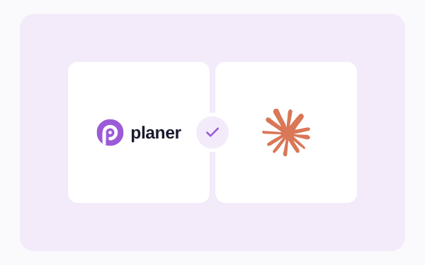 |
| **ReleaseHero** | 1600×900 (render at `scale: 3`) | Copy left, brand stage right. The spa's release screen at ×1.47 | `stage.canvas` = `{520,440}`, the same canvas as the spa's release visuals, so their coordinates copy straight over; `stage.layers`; `stage.background` | 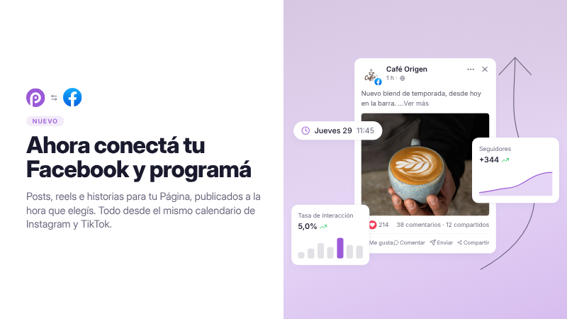 |
| **EmailBanner** | 1200×600 | Copy left, 540px stage right | `stage` (layers in stage px); `stageWidth` | 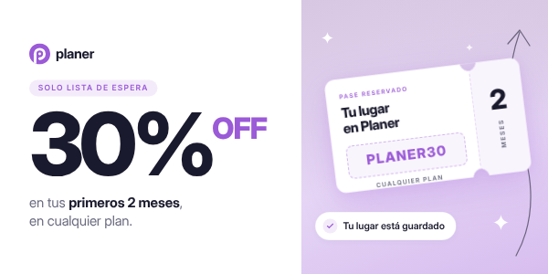 |
| **LinkedInPost** | 1200×627 | Copy left, 560px stage right | `stage`, `stageWidth` | 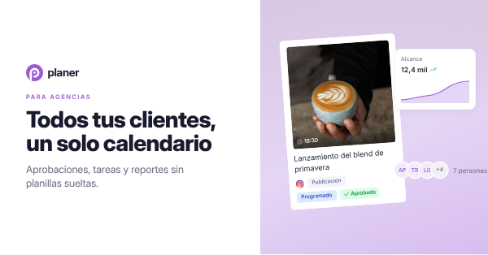 |
| **OgImage** | 1200×630 | Copy left, 520px stage right | `stage`, `stageWidth` | 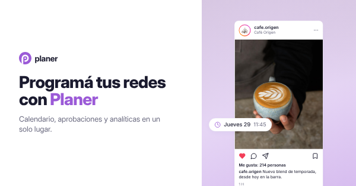 |
| **IgPost** | 1080×1080 | Full-bleed poster; copy block + free layers | `background`, `layers`, `copyPosition` (`top`/`center`/`bottom`), `align`, `footer` | 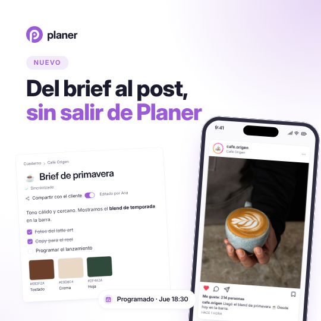 |
| **IgCarouselSlide** | 1080×1350 | Poster + `02 / 05` counter + swipe hint | as IgPost + `slide`, `total`, `swipeHint` | 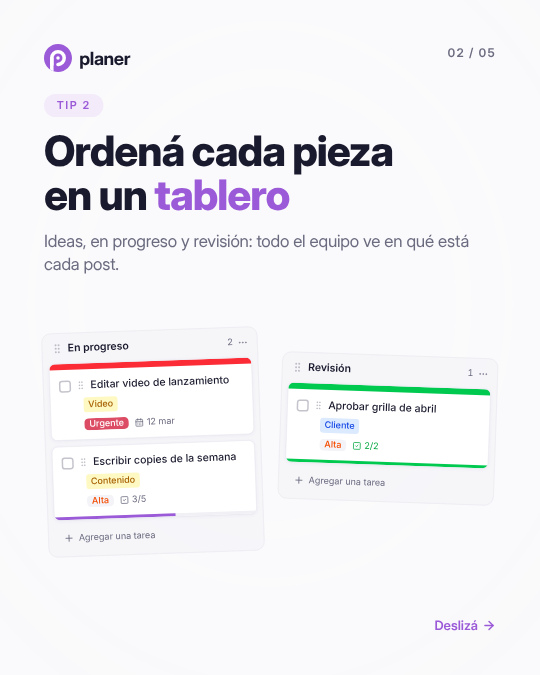 |
| **IgStory** | 1080×1920 | Poster with Instagram safe areas (≈250 top / ≈340 bottom kept clear of copy) | as IgPost | 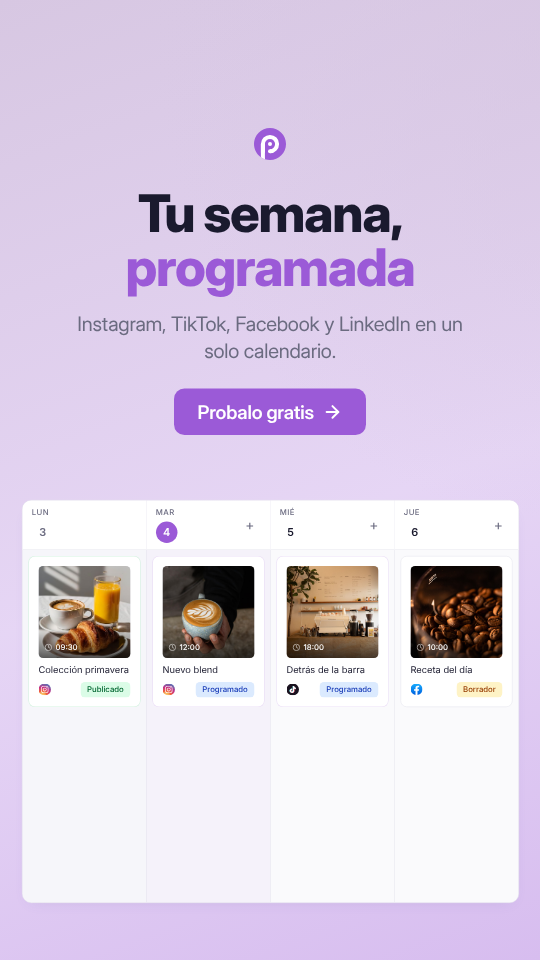 |

## Primitives (`src/primitives/`)

| Name | Use it for | Main props | Thumbnail |
|---|---|---|---|
| **Logo** | The Planer mark (brand violet in both themes) | `size` | 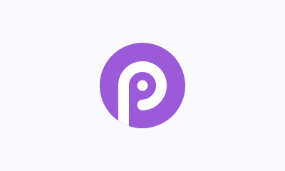 |
| **Wordmark** | Mark + "planer" | `size` (mark height) | 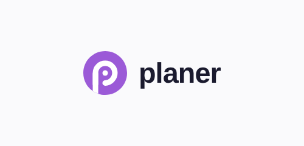 |
| **LogoLockup** | Planer ⇄ partner, as in releases | `size`, `platform` or `icon` (lucide name) | 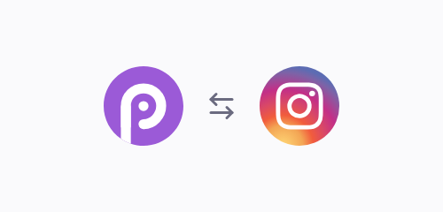 |
| **IntegrationTiles** | Two logo tiles joined by a round badge, on an optional tinted panel. Partner logos live in `public/assets/partners/` in their own colours | `left`, `right`, `size` (tile side), `icon`, `panel` | 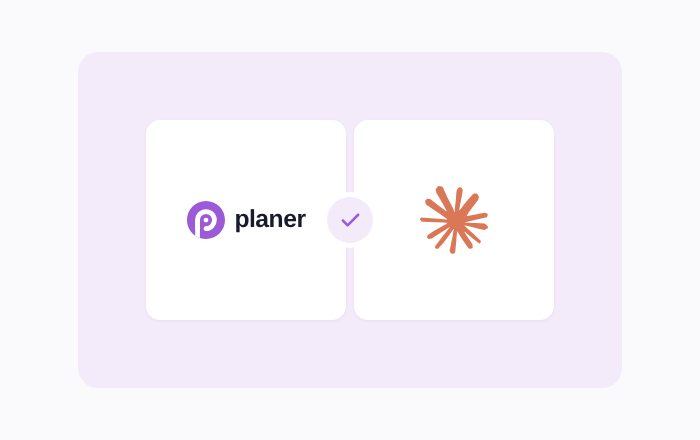 |
| **IntegrationHandoff** | "Planer ↘ partner": two tilted LogoChips joined by a looping HandArrow, on a strong tint | `from`, `to` (same logos as IntegrationTiles), `width` (height = 0.6×), `panel` | 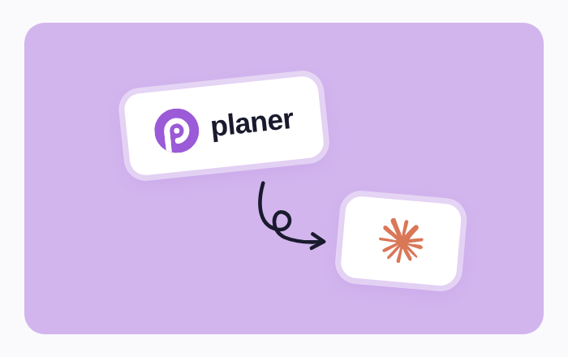 |
| **LogoChip** | A logo on a rounded card chip with a translucent halo; tilt it with the layer's `rotate` | `logo`, `size` (logo height), `halo` | 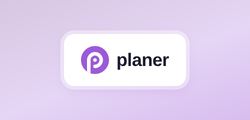 |
| **Pill** | Uppercase capsule: "NUEVO", "SOLO LISTA DE ESPERA" | `label`, `tone` (`brand`·`muted`·`outline`·`solid`), `size`, `icon`, `density` (`regular`·`compact`) | 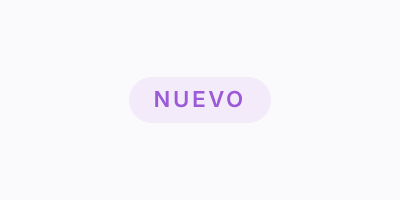 |
| **Eyebrow** | Small tracked kicker above a title | `label`, `size`, `tone` | 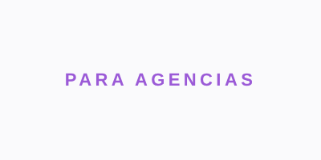 |
| **Headline** | Display title, Inter 800, tracking-tight | `text` (`**b**`, `[[accent]]`, `\n`), `size`, `weight`, `align` | 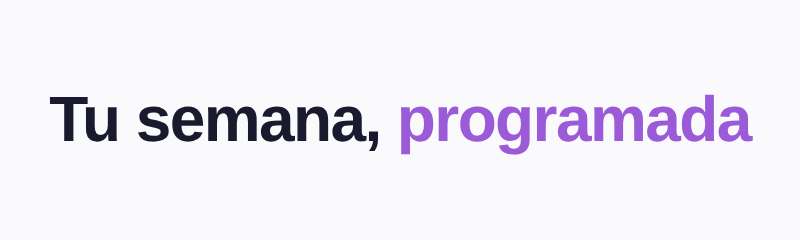 |
| **Subhead** | Muted supporting paragraph | `text`, `size`, `align` | 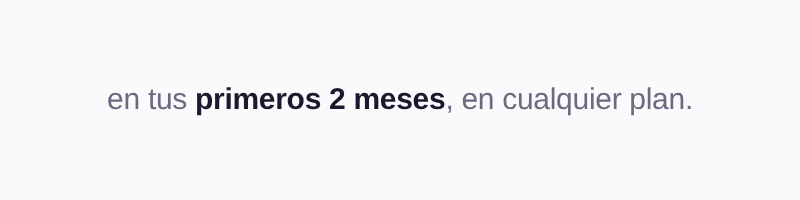 |
| **BigStat** | Oversized number + raised suffix ("30% OFF") | `value`, `suffix`, `size` | 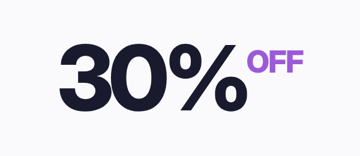 |
| **Cta** | Button-shaped call to action | `label`, `variant` (`brand`·`outline`·`foreground`), `size`, `icon` (`"none"` hides it) | 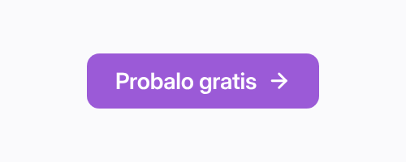 |
| **Background** | Fills a canvas or stage | `variant` (`flat`·`gradient`·`grid`·`glow`), `surface` (`card`·`background`·`muted`), `cell` | Used by every template |
| **Sparkle** | Four-point sparkle decoration | `size`, `color` (`card`·`white`·`brand`·`ink`), `opacity` | 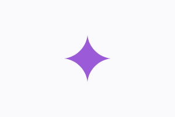 |
| **HandArrow** | Hand-drawn growth arrow | `variant` (`rise`·`swoop`·`loop`), `color` (`ink`·`foreground`·`brand`·`card`·`white`), `width`, `height`, `strokeWidth`, `flip` | 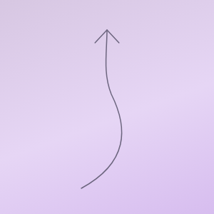 |
| **CouponTicket** | Tear-off pass with a promo code (campaigns) | `eyebrow`, `title`, `code`, `foot`, `stubValue`, `stubUnit` | 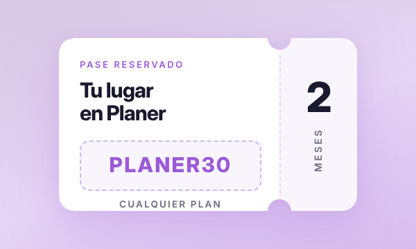 |

## Mockups (`src/mockups/`), faithful copies of Planer's UI

| Name | Use it for | Main props | Thumbnail |
|---|---|---|---|
| **PostCard** | A post as it looks in each network's feed | `platform` (`instagram`·`facebook`·`tiktok`·`linkedin`), `name`, `handle`, `avatar`, `image`, `caption`, `time`, `likes`/`comments`/`shares`, `width`, `aspect` | 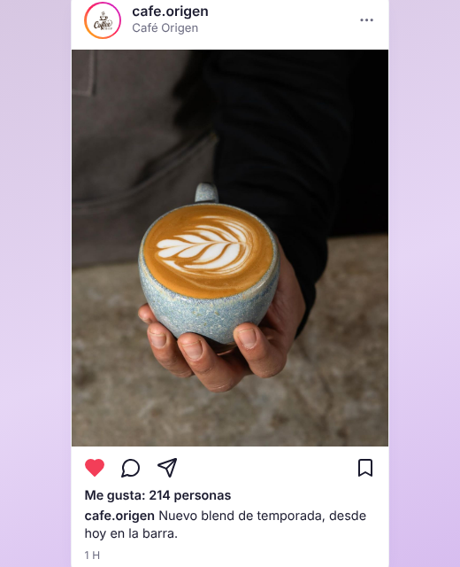 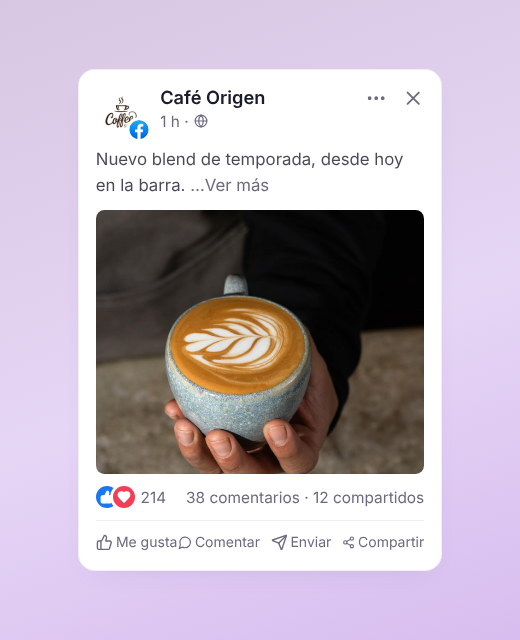 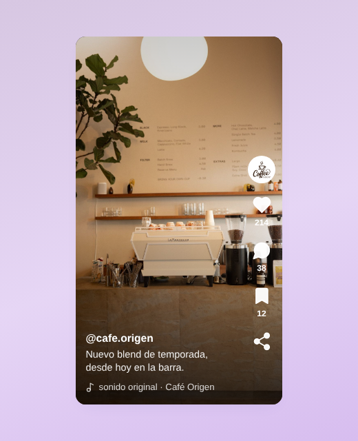 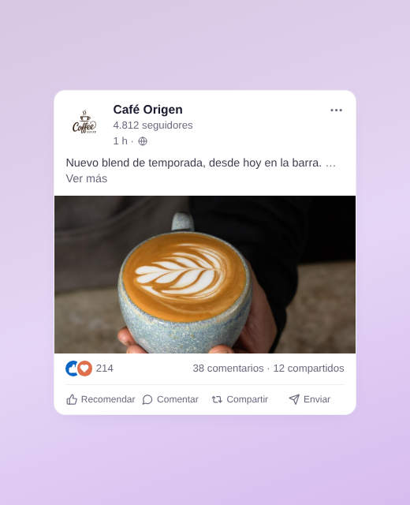 |
| **PublicationCard** | A scheduled post in Planer's calendar | `caption`, `time`, `platform`, `format`, `status` (`draft`·`scheduled`·`published`·`paused`·`manual`·`error`), `approved`, `image` or `tint`, `width` | 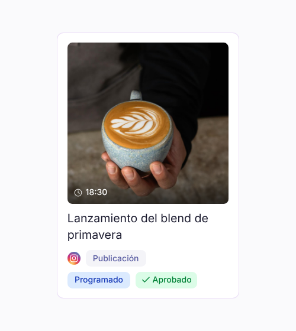 |
| **CalendarWeek** | Planer's week view with posts | `startDay`, `today`, `days` (1–7 columns), `posts[]` (PublicationCard props + `day`), `columnWidth`, `height` | 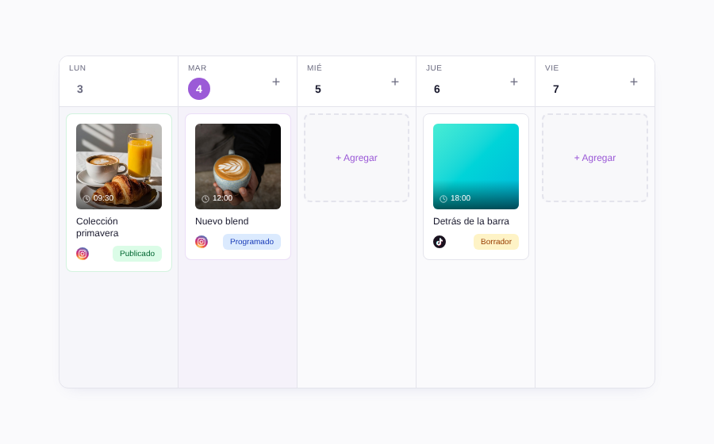 |
| **KanbanColumn** | One list of the tasks board | `name`, `tasks[]` (`title`, `labels`, `priority`, `dueDate`, `checklistDone`/`Total`, `cover`, `done`), `width` | 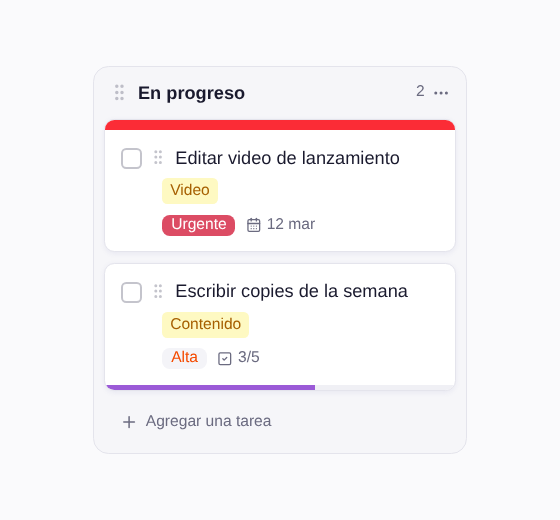 |
| **FeedGrid** | Instagram profile + grid with scheduled posts (spa feed preview) | `username`, `avatar`, `posts`/`followers`/`following`, `bio`, `cells[]` (`image` or `tint`, `scheduled` date, `isNew`, `format`), `width` | 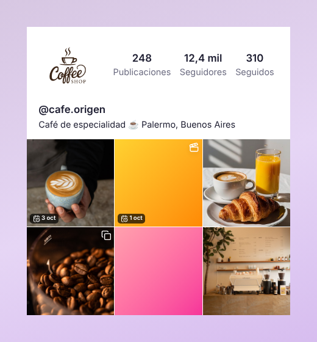 |
| **NotebookPage** | A Cuaderno page | `client`, `parent`, `icon`, `title`, `shared`, `editedBy`, `blocks[]` (`heading`·`paragraph`·`bullets`·`todos`·`palette`), `width` | 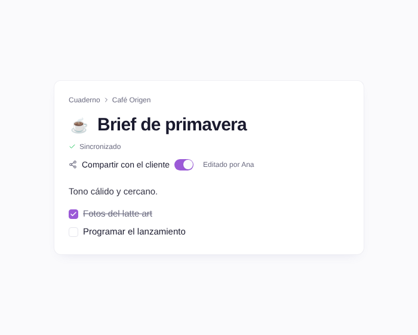 |
| **PhoneFrame** | Modern phone; `children` layers flow inside | `width`, `screen` (`background`·`card`·`black`), `time`, `center`, `padding` | 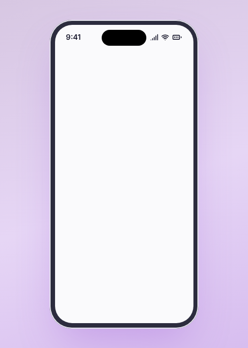 |
| **BrowserFrame** | Desktop browser window; `children` inside | `width`, `height`, `url` | 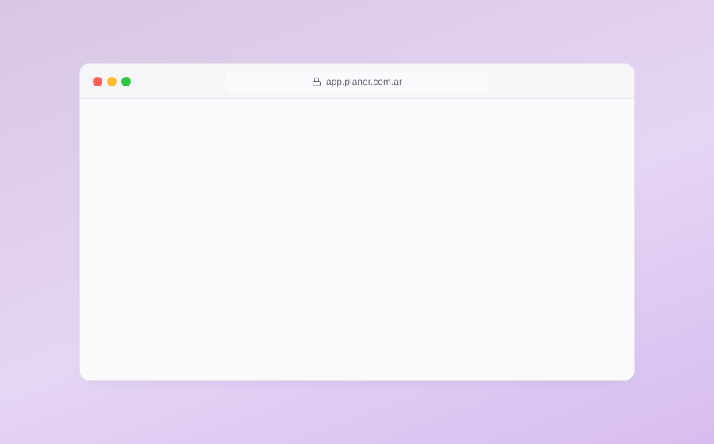 |
| **AnalyticsCard** | Floating metric tile | `label`, `value`, `trend` (`up`·`down`·`none`), `chart` (`bars`·`area`·`none`), `bars`, `highlight`, `width` | 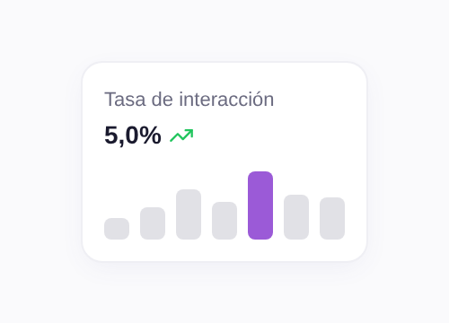 |
| **NotificationToast** | Slot pill ("Jueves 29 · 11:45"), confirmation chip, or toast | `variant` (`pill`·`toast`), `title`, `meta`, `icon` or `platform`, `iconBadge`, `size` | 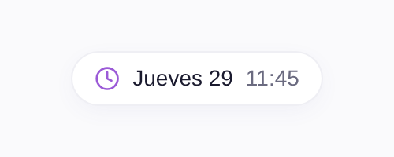 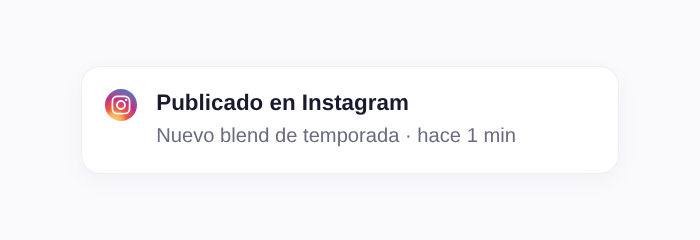 |
| **AvatarStack** | Overlapping team avatars | `people[]` (`name`, `image`), `extra`, `size`, `label` | 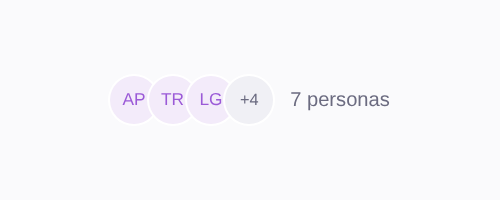 |

## App screens (`src/mockups/screens.tsx`), full Planer screens

Ported from `spa/components/design-system/screens` + `composites`, which mirror the real app. Each screen
is a fixed box (`width`/`height`, app scale) with the sidebar included. Scale it with the layer's `zoom`, or
set `bare: true` to drop the border and shadow and put it inside a `BrowserFrame` (see
`content/2026-10-analiticas/linkedin-post.json`). **Every prop of the spa screen passes through**, so you can
override the data (`kpis`, `trend`, `topPosts`, `stats`, `posts`, `lists`…) and the frame (`clientName`,
`userName`…). UI text is **Spanish only**.

| Name | Screen | Default size | Main props (besides width/height/bare) | Thumbnail |
|---|---|---|---|---|
| **DashboardScreen** | Inicio: greeting, 4 stats, upcoming posts, quick actions | 1240×780 | `greeting`, `date`, `stats[]`, `upcoming[]` | 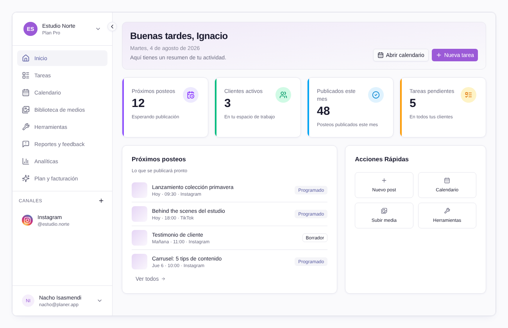 |
| **AnalyticsScreen** | Analíticas: account + period, 4 KPIs, reach vs. impressions chart, top posts | 1240×812 | `account`, `kpis[]` (`label`,`value`,`delta`,`up`), `trend[]` (`day`,`reach`,`views`), `topPosts[]` | 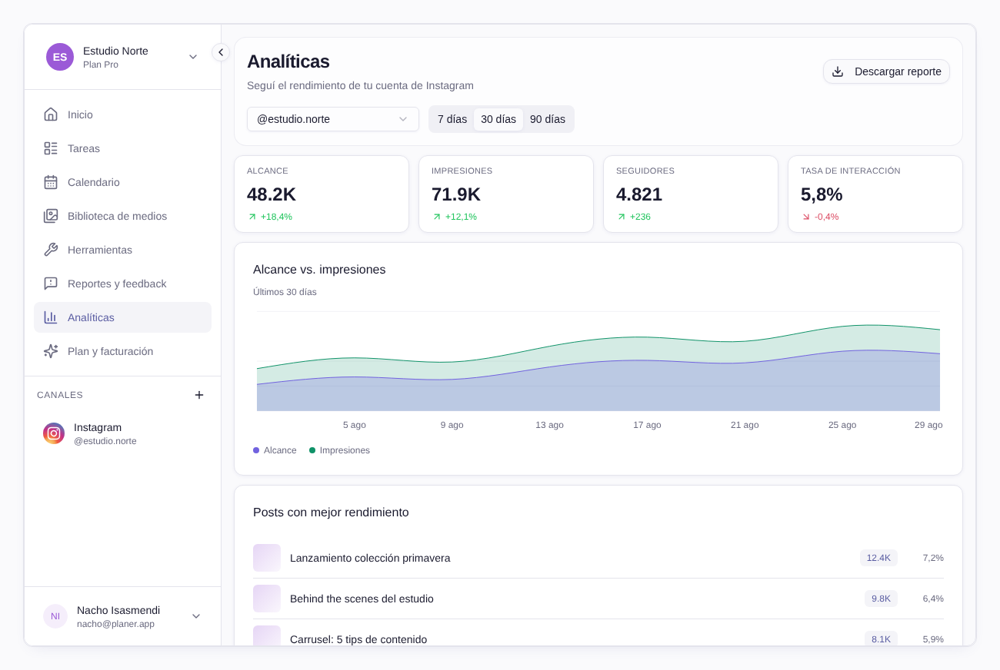 |
| **EngagementScreen** | Interacción: comments per post with replies | 1240×780 | `account`, `posts[]` with `comments[]` | 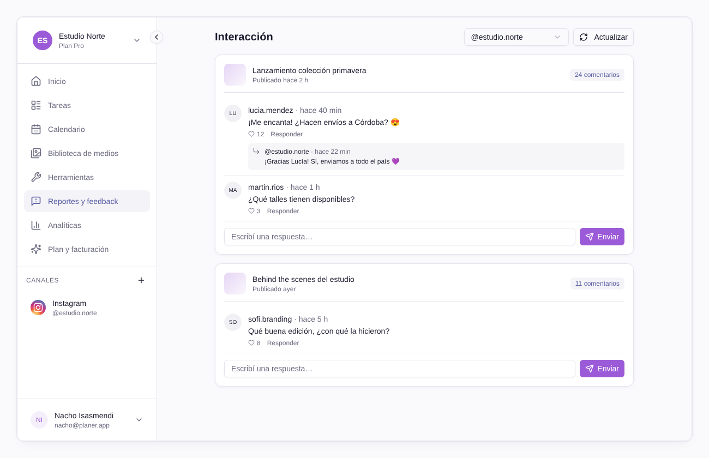 |
| **MediaScreen** | Biblioteca de medios: folders, assets, storage usage | 1240×780 | `folders[]`, `assets[]`, `usedGb`, `totalGb` | 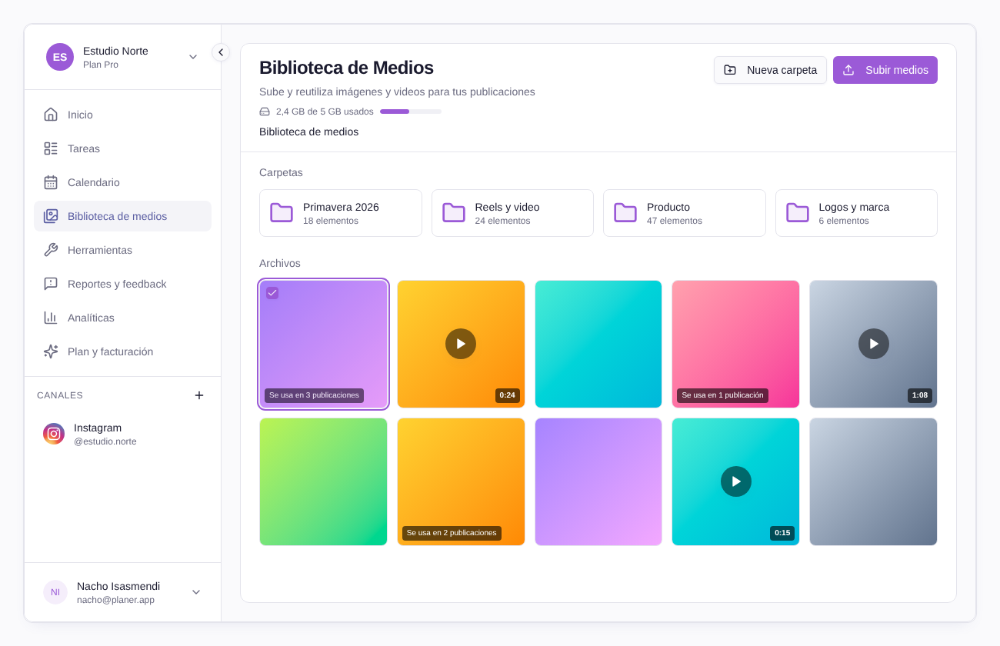 |
| **CalendarScreen** | Calendario, month or week, with the calendar topbar | 1240×780 | `view` (`month`·`week`), `posts[]`, `monthLabel`, `weekLabel`, `todayDay` | 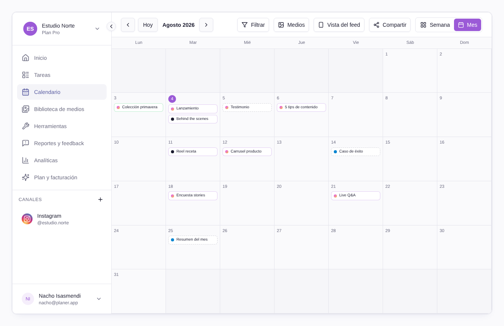 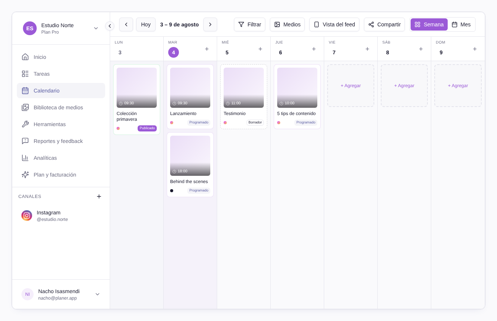 |
| **TasksScreen** | Tareas: kanban board with lists and task cards | 1240×780 | `boardName`, `view`, `lists[]` (`name`, `tasks[]`) | 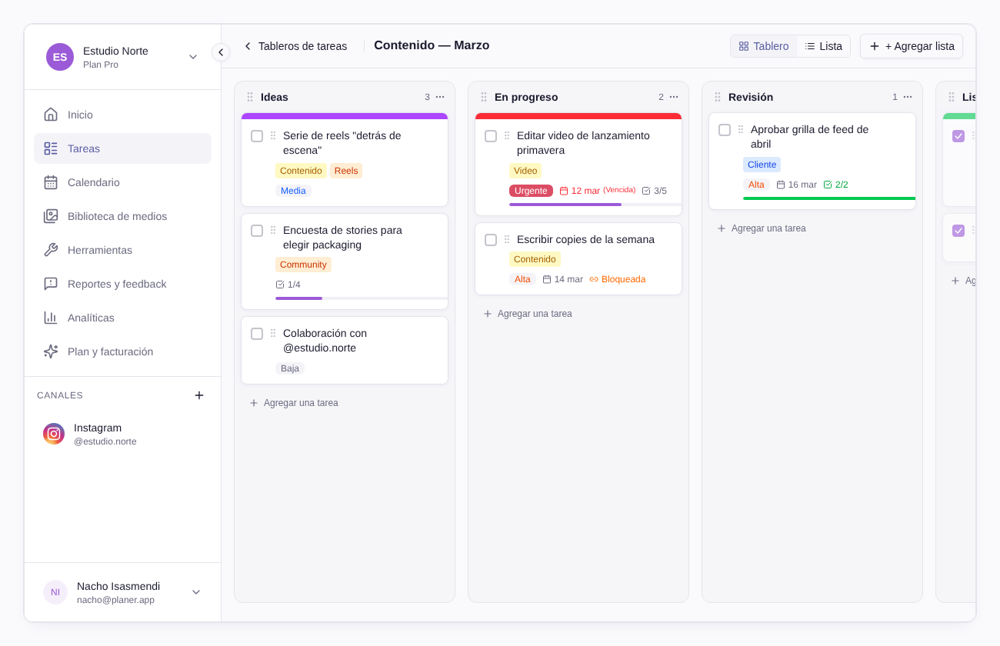 |
| **SchedulePostModal** | The composer: account, format tabs, media, caption, live preview | 1100×720 | `format` (`feed`·`reel`·`story`), `caption`, `accounts[]`, `tab` | 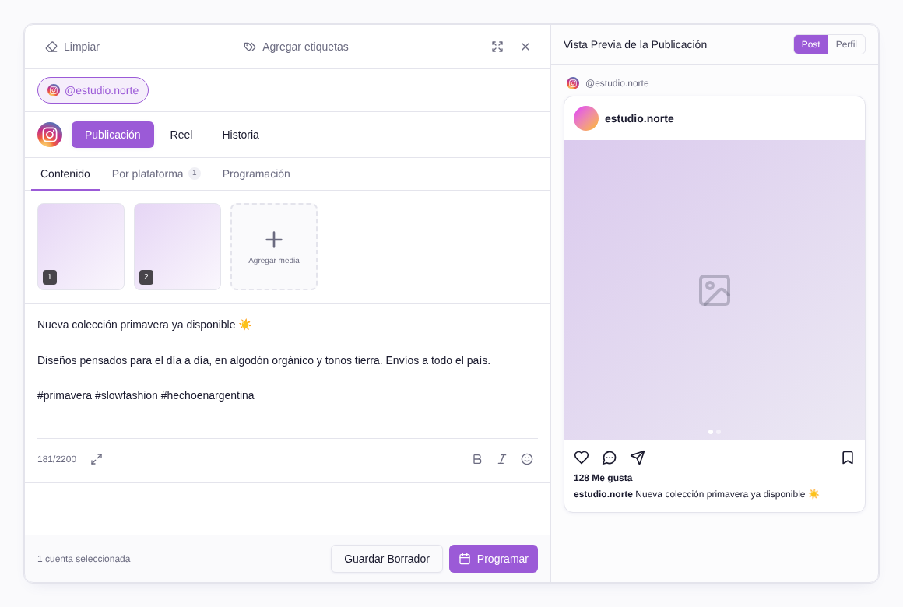 |
| **AppFrame** | Just the chrome (sidebar); nested `children` layers go in the content area | 1240×780 | `active` (nav row), `clientName`, `plan`, `channels[]`, `topbar` | 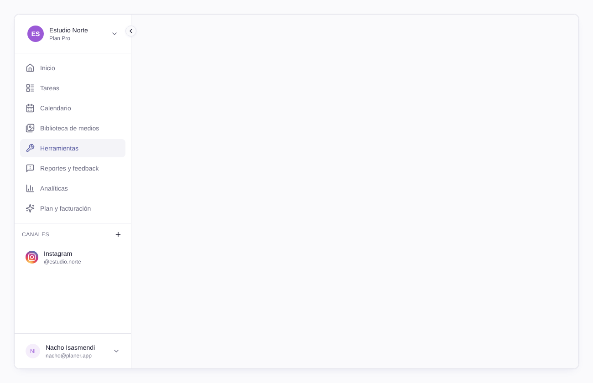 |
| **CampaignCard** | A campaign card | 340 wide | `name`, `description`, `color`, `startDate`, `endDate`, `postCount` | 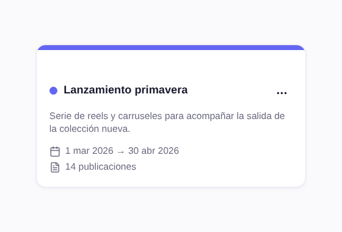 |
| **PlanBadge** | The "Plan Pro" usage badge | auto | `plan`, `tone` (`normal`·`amber`·`red`) | 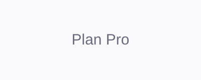 |
| **TrialBanner** | Free-trial countdown strip | 720 wide | `daysLeft`, `cta` | 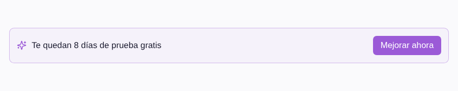 |
| **FounderBanner** | "Precio Fundador" countdown strip | 720 wide | `daysLeft`, `expired`, `announcementLabel` | 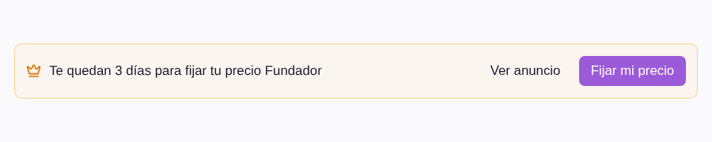 |

For the exact prop shapes, read the interfaces at the top of each file in `src/mockups/app/`.

**Images** for `avatar`/`image` are paths under `public/`: `assets/photos/{cafe-especialidad,cafetera,coffee,croissant}.jpg`,
`assets/photos/cafe-icon.png`. Add new demo photos there. They must be neutral, fictional brands, never real clients.

## Adding to the system

Missing something? Add it as a component or template first, then use it:
1. Write the component in `src/primitives/` or `src/mockups/` with a zod schema (`<name>Schema`). For product UI, copy the styles from the spa and don't import from it.
2. Register it in `REGISTRY` (`src/templates/stage.tsx`).
3. Add a specimen in `src/catalog/specimens.ts` (feeds both the thumbnails and the sheet) and a row in this file, then run `npm run catalog && npm run sheet`.
